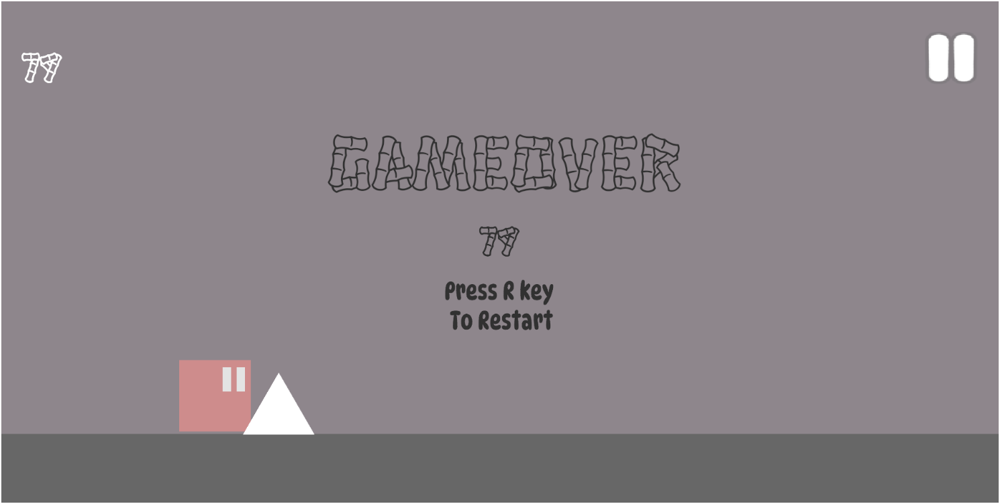

## UNITY-EndlessRunner
There is a unity Endless2D Sprite and Script are available 

## key Feacture
#### 1. Player Controls 
Player Jumping on J Axis By pressing "Space"

#### 2. Obstacles & Enemies:
 Obstacles like spikes, pits, and moving platforms, as well as enemies with basic AI, are scattered throughout the level. The player must avoid these to prevent damage or falling off the platform.

#### 3. Scoring System: 

The score is tracked based on the distance traveled or the number of obstacles avoided. The player’s score continues to increase as long as they avoid obstacles and stay alive.

#### 4. Game Over and Restart: 
When the player hits an obstacle or falls off the platform, the game ends. A Game Over screen appears, showing the final score and providing an option to restart the game.

### MainMenu

### Scene View 

### Game View

### Apk
There is apk play enjoy the game and give review
[Endless Runner](Game)
